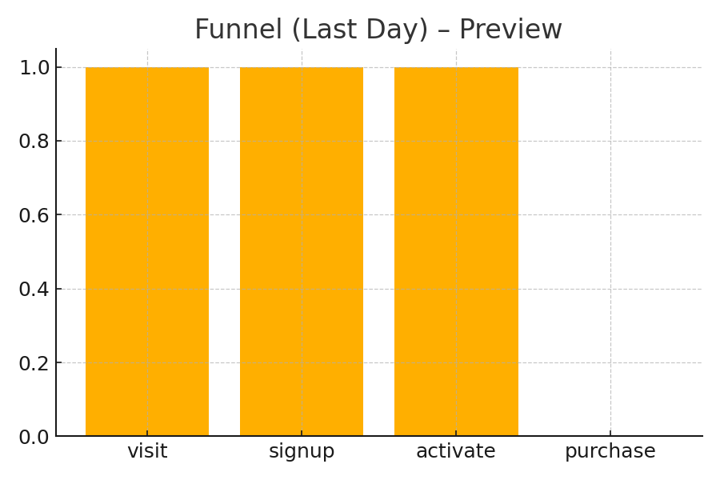
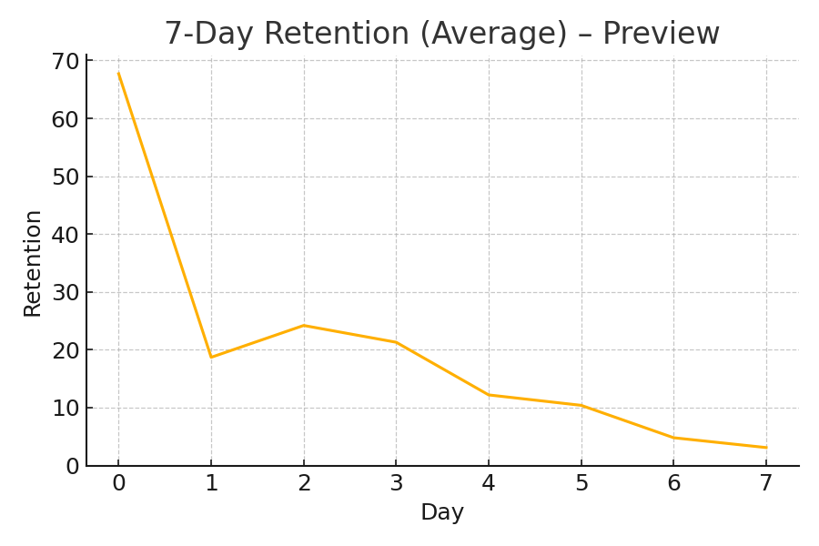

# Self-Serve Metrics Stack (dbt-style with DuckDB + Prefect + Superset-ready)
A lightweight **Analytics Engineer / Associate Data Engineer** demo: events → models → scheduled builds → charts.

## Contents
- `seeds/events.csv` — synthetic product events (visit, signup, activate, purchase)
- `models/` — DuckDB-compatible SQL (staging + marts: sessions, funnel, retention)
- `flows/flow.py` — optional **Prefect** flow to run models
- `scripts/run_once.py` — builds the models and exports `outputs/*.csv` and charts
- `images/` — generated charts (after running the script)

## Quickstart (local)
```bash
python -m venv .venv && source .venv/bin/activate
pip install -r requirements.txt
python scripts/run_once.py
```

## Screenshots



[](LICENSE)
